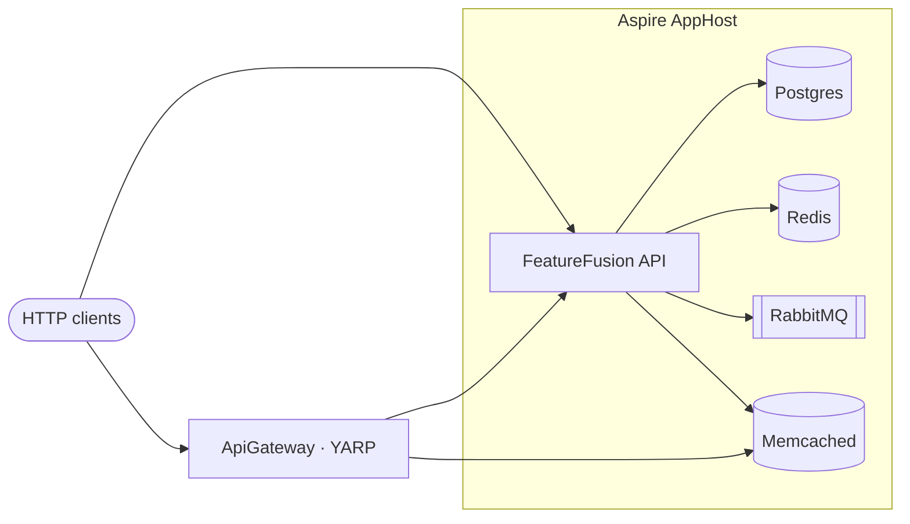

<div align="center">

# FeatureFusion

**Advanced .NET lab** — real patterns from LinkedIn deep-dives, runnable locally with Aspire.

[](https://dotnet.microsoft.com/)
[](https://learn.microsoft.com/dotnet/aspire/)
[](LICENSE.txt)
[](https://github.com/Maxofpower/FeatureManagement/stargazers)
[](https://github.com/Maxofpower/FeatureManagement/commits)
[](https://www.linkedin.com/in/mhhoseini/)
[](https://github.com/Maxofpower/FeatureManagement)

[Author · Mohammad Hasan Hosseini](https://www.linkedin.com/in/mhhoseini/) · Technical Team Lead & .NET enthusiast

</div>

---

## Table of contents

- [What's inside](#whats-inside)
- [Architecture](#architecture)
- [Stack](#stack)
- [Repository layout](#repository-layout)
- [Prerequisites](#prerequisites)
- [Quick start](#quick-start)
- [Features](#features)
- [Design patterns](#design-patterns)
- [LinkedIn catalog](#linkedin-catalog)
- [What's next](#whats-next)
- [Testing](#testing)
- [Contributing](#contributing)

---

## What's inside

| Area | What you get |
|------|----------------|
| Feature management | ASP.NET Core Feature Management + custom filters (claims / VIP demos) |
| Event bus | RabbitMQ + transactional outbox/inbox, DLQ, dedup hooks |
| Aspire | AppHost orchestration for Postgres, Redis, RabbitMQ, Memcached |
| IdempotentFusion | ULID `Idempotency-Key` + Redis status tracking + optional lock |
| Mediator (CQRS) | Manual Mediator + pipeline behaviors |
| API surface | Versioned controllers + Minimal APIs, FluentValidation patterns |
| Gateway | YARP reverse proxy + Memcached distributed rate limiting |
| Caching | Redis / Memcached / memory managers + middleware demos |
| Pagination | **Generic bidirectional keyset (cursor) pagination** — type-safe Base64 cursors, dynamic sort, expression trees |
| Design patterns | Mediator, Adapter, Decorator, CoR, Strategy, and more — see below |

Also covered in the lab: app/DB initializers, middleware dynamic caching, Aspire AppHost integration tests, and performance-minded practices (OTel hooks, resilience).

> Aspire-hosted functional tests and compose need **Docker**.

---

## Architecture



---

## Stack

[](https://learn.microsoft.com/aspnet/core/)
[](https://www.npgsql.org/efcore/)
[](https://www.rabbitmq.com/)
[](https://stackexchange.github.io/StackExchange.Redis/)
[](https://microsoft.github.io/reverse-proxy/)
[](https://opentelemetry.io/)
[](https://xunit.net/)
[](https://www.docker.com/)

**.NET 10** (`net10.0`) · **Aspire 13.4.x** · FluentValidation · Feature Management · Memcached (Enyim)

---

## Repository layout

```text
src/
  FeatureFusion/                    # Web API (Features/, Infrastructure/, Controllers, Minimal APIs)
  EventBusRabbitMQ/                 # Reusable RabbitMQ event bus library
  FeatureFusion.ApiGateway/         # YARP + Memcached rate limiter
  FeatureFusion.AppHost.AppHost/    # Aspire AppHost
  FeatureFusion.AppHost.ServiceDefaults/
tests/
  IntegrationTests/                 # Aspire fixture · EventBus + HTTP API smoke
  FeatureFusion.Test/               # Unit / filter / mediator
  FeatureFusion.ApiGateway.Test/
  FeatureFusion.Common/
docs/
  linkedin-posts.md                 # Post ↔ code map
```

<details>
<summary>Preferred vertical-slice shape</summary>

```text
Features/{Name}/
  Commands/
  Queries/
  Behaviors/
  IntegrationEvents/
```

</details>

---

## Prerequisites

| Tool | Why |
|------|-----|
| [.NET 10 SDK](https://dotnet.microsoft.com/download) | Build & run |
| [Docker Desktop](https://www.docker.com/products/docker-desktop/) (Linux containers, running) | Aspire resources, Compose, functional tests |
| Aspire dashboard (optional) | Resource graph when using AppHost |

If the Aspire dashboard shows **Container runtime not installed** while `docker info` works, set `DOTNET_ASPIRE_CONTAINER_RUNTIME=docker` (AppHost already sets this) and restart the IDE/terminal so PATH includes Docker CLI.

---

## Quick start

### Option A — Aspire AppHost (recommended)

```bash
dotnet run --project src/FeatureFusion.AppHost.AppHost
```

Starts Postgres, Redis, RabbitMQ, Memcached, and `FeatureFusion`. Open the Aspire dashboard URL printed in the console.

### Option B — Docker Compose

```bash
docker compose up -d --build
```

Uses SDK / ASP.NET **10.0** images plus supporting services.

### Option C — API only

```bash
dotnet restore FeatureManagementFilters.sln
dotnet run --project src/FeatureFusion --launch-profile https
```

Point connection strings in `appsettings.*.json` (or user secrets) at your local infra.

<details>
<summary>Feature-flag greeting smoke</summary>

1. `POST /api/v1/Auth/login` with `vipuser` / `vippassword`
2. `GET /api/v1/Greeting/custom-greeting` with `Authorization: Bearer <token>`

</details>

---

## Features

### RabbitMQ EventBus (outbox / inbox / DLQ)

Transactional outbox with optional direct publish fallback, inbox/dedup hooks, DLX, and Aspire-hosted integration tests.

**Setup:** AppHost or Compose, then `dotnet test tests/IntegrationTests`.  
**LinkedIn:** see the [catalog](docs/linkedin-posts.md).

### Distributed rate limiting (YARP + Memcached)

IP-based fixed-window limiting at the reverse proxy with Memcached-backed counters. Excess traffic receives `429 Too Many Requests`.

```bash
docker compose up -d
# point traffic at the ApiGateway (see launchSettings / appsettings)
```

### Feature management filters

Conditional features via Microsoft.FeatureManagement and custom filters (e.g. VIP claims). Versioned controllers and Minimal APIs under `/api/v1|v2/...`.

### IdempotentFusion

REST idempotency with ULID keys and Redis status tracking (`POST /api/v2/Order/order`).

- [Idempotency with MediatR/CQRS](https://www.linkedin.com/feed/update/urn:li:activity:7303686809891356676/)
- [IdempotentFusion project](https://www.linkedin.com/feed/update/urn:li:activity:7309149985307029504/)

### Manual Mediator + pipeline behaviors

Hand-rolled CQRS Mediator with cached wrappers and void-request Adapter.

- [Mediator Pattern + Pipeline Behavior](https://www.linkedin.com/feed/update/urn:li:activity:7311311587372367873/)

### API versioning & validation

Controllers + Minimal API groups; FluentValidation via controllers, generic endpoint filters, and `WithValidation` / `MapPostWithValidation`.

### Caching, middleware & pagination

Redis / Memcached / memory managers, feature-flagged recommendation cache middleware, and DB migration/seed initializers.

### Generic bidirectional cursor (keyset) pagination

Reusable, type-safe keyset pagination for EF Core: Base64 JSON cursors (last value + id + sort + direction), dynamic sorting, forward/back navigation, and expression-tree filters — integrated with CQRS / Mediator.

- Code: `src/FeatureFusion/Infrastructure/CursorPagination`
- Demo: product listing via `ProductService` / `PaginationHelper`
- LinkedIn: [Reusable Cursor (keyset) Pagination](https://www.linkedin.com/feed/update/urn:li:activity:7325068550614708225/)

---

## Design patterns

| Pattern | Where it shows up |
|---------|-------------------|
| **Mediator** | `Infrastructure/CQRS` — send + pipeline behaviors |
| **CQRS** | `Features/.../Commands` + `Queries` with dedicated handlers |
| **Adapter** | Void-request adapter bridging `IRequest` / `Unit` |
| **Decorator** | Pipeline behaviors; EventBus handler decorators in tests |
| **Singleton** | Cached mediator wrappers / long-lived Redis multiplexer |
| **Factory** | Resilience / connection helpers; `CursorFactory`; gateway Memcached factory |
| **Repository / DbContext** | EF Core `CatalogDbContext` + feature handlers |
| **Unit of work** | `ResilientTransaction` spanning business write + outbox |
| **Strategy** | Feature filters & validation styles (controller vs Minimal API) |
| **Template method** | `BaseValidator.PostInitialize` |
| **Keyset pagination** | `Infrastructure/CursorPagination` — type-safe bidirectional cursors |
| **Chain of Responsibility** | Feature toggle rule evaluation; mediator pipeline chain |
| **Observer / messaging** | RabbitMQ integration events (outbox → bus → handlers) |
| **Outbox / Inbox** | `TransactionalOutbox` + `OutBoxWorker` |
| **Polling publisher** | `OutBoxWorker` background poll → publish |
| **Dead letter queue** | EventBus DLX / DLQ topology |
| **Message deduplication** | Inbox + `MessageDeduplicationService` |
| **Idempotency** | `IdempotentAttribute` + Redis status tracking |
| **Feature toggle** | ASP.NET Core Feature Management + custom filters |
| **Rate limiting** | ApiGateway Memcached fixed-window limiter |
| **Circuit breaker / resilience** | Polly `ResiliencePipelineFactory` |
| **Options** | `AddOptions` / `IOptions<>` for EventBus, Redis, Memcached |
| **Middleware pipeline** | `RecommendationCacheMiddleware` |
| **Cache-aside** | Memcached/Redis `GetValueOrCreateAsync` |
| **Result object** | `Result<T>` + `Match` / HTTP mapping |
| **API Gateway / reverse proxy** | YARP `FeatureFusion.ApiGateway` |
| **API versioning** | Asp.Versioning on controllers and Minimal APIs |
| **Dependency Injection** | `Program` / `BuilderExtensions` composition |

---

## LinkedIn catalog

Post ↔ code map: [`docs/linkedin-posts.md`](docs/linkedin-posts.md) · [Follow on LinkedIn](https://www.linkedin.com/in/mhhoseini/)

---

## What's next

This remains a **public advanced-.NET lab**. Near-term direction (no internal delivery plan here):

- Keep extracting reusable pieces from the Mediator / pipeline work into shareable building blocks
- Keep the LinkedIn catalog in sync when new posts ship
- Pub/sub stays a **sibling** story (not Mediator notifications)

---

## Testing

```bash
dotnet test FeatureManagementFilters.sln -c Release
```

| Project | Notes |
|---------|--------|
| `IntegrationTests` | Shared Aspire fixture — EventBus integration **and** HTTP API smoke (`Api/FeatureFusionApiTests`) |
| `FeatureFusion.Test` | Unit / filter / mediator (single-dependency containers where useful) |
| `FeatureFusion.ApiGateway.Test` | Memcached-backed limiter tests |

API / functional coverage uses the **Aspire** fixture in `IntegrationTests` (dynamic ports; stop a local AppHost if you still hit conflicts).

---

## Contributing

PRs welcome. Prefer vertical-slice feature folders, XML docs on public APIs, constants over magic strings, and tests + catalog updates when behavior changes.

License: [LICENSE.txt](LICENSE.txt)
