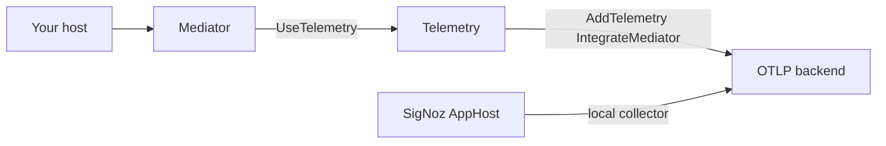
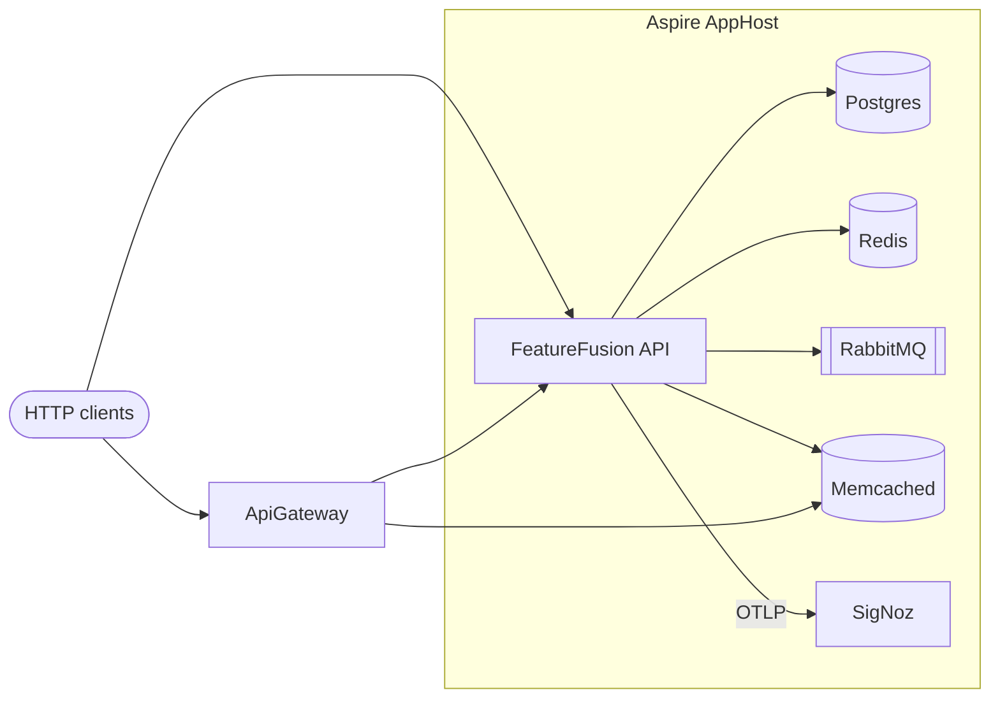

<div align="center">

# FeatureFusion

**BuildingBlocks for .NET** — CQRS Send + pipeline, HTTP Idempotency-Key, config-driven OpenTelemetry, MCP tools, keyset pagination, and a local Aspire SigNoz stack — plus a runnable lab that uses them.

Formerly [FeatureManagement](https://github.com/Maxofpower/FeatureManagement) (GitHub redirects).

[](https://dotnet.microsoft.com/)
[](https://learn.microsoft.com/dotnet/aspire/)
[](https://www.nuget.org/packages/BuildingBlocks.Mediator)
[](https://www.nuget.org/packages/BuildingBlocks.Mcp)
[](https://www.nuget.org/packages/BuildingBlocks.Idempotency)
[](https://www.nuget.org/packages/BuildingBlocks.Pagination.EntityFrameworkCore)
[](https://www.nuget.org/packages/BuildingBlocks.Telemetry)
[](https://www.nuget.org/packages/BuildingBlocks.Aspire.Hosting.SigNoz)
[](LICENSE.txt)
[](https://github.com/Maxofpower/FeatureFusion/stargazers)
[](https://github.com/Maxofpower/FeatureFusion/commits)
[](https://www.linkedin.com/in/mhhoseini/)
[](https://github.com/Maxofpower/FeatureFusion)

[Author · Mohammad Hasan Hosseini](https://www.linkedin.com/in/mhhoseini/) · Technical Team Lead & .NET enthusiast

</div>

---

## Table of contents

- [BuildingBlocks](#buildingblocks)
  - [How they work together](#how-they-work-together)
  - [BuildingBlocks.Mediator](#buildingblocksmediator)
  - [BuildingBlocks.Mcp](#buildingblocksmcp)
  - [BuildingBlocks.Idempotency](#buildingblocksidempotency)
  - [BuildingBlocks.Pagination.EntityFrameworkCore](#buildingblockspaginationentityframeworkcore)
  - [BuildingBlocks.Telemetry](#buildingblockstelemetry)
  - [BuildingBlocks.Aspire.Hosting.SigNoz](#buildingblocksaspirehostingsignoz)
- [Lab](#lab)
  - [Pagination showcase](#pagination-showcase)
- [Architecture](#architecture)
- [Stack](#stack)
- [Repository layout](#repository-layout)
- [Prerequisites](#prerequisites)
- [Run the lab](#run-the-lab)
- [Lab features](#lab-features)
- [Design patterns](#design-patterns)
- [LinkedIn catalog](#linkedin-catalog)
- [What's next](#whats-next)
- [Testing](#testing)
- [Contributing](#contributing)

---

## BuildingBlocks

NuGet packages you can install in **your** hosts. The FeatureFusion API is a showcase, not a required dependency.

| Package | Version | Role | TFMs |
|---------|---------|------|------|
| **[BuildingBlocks.Mediator](https://www.nuget.org/packages/BuildingBlocks.Mediator)** | **1.1.0** | CQRS **Send** + ordered pipeline (`ICommand` / `IQuery`, typed behaviors, opt-in traces + metrics) | net8 / net9 / net10 |
| **[BuildingBlocks.Mcp](https://www.nuget.org/packages/BuildingBlocks.Mcp)** | **1.0.0** | Message types → MCP tools on the official SDK (deny-by-default, `McpResult`, HTTP + opt-in stdio) | net8 / net9 / net10 |
| **[BuildingBlocks.Idempotency](https://www.nuget.org/packages/BuildingBlocks.Idempotency)** | **1.0.0** | HTTP **Idempotency-Key** — MVC + Minimal API, 2xx envelope replay, ProblemDetails, optional Redis lock, fingerprint, ActivitySource | net8 / net9 / net10 |
| **[BuildingBlocks.Pagination.EntityFrameworkCore](https://www.nuget.org/packages/BuildingBlocks.Pagination.EntityFrameworkCore)** | **1.1.0** | Typed keyset (cursor) pagination for EF Core (IR bundled): any-width Npgsql row comparison, `NULLS FIRST/LAST`, `HasKeysetIndex` + `NullOrder` | net8 / net9 / net10 |
| **[BuildingBlocks.Telemetry](https://www.nuget.org/packages/BuildingBlocks.Telemetry)** | **1.0.2** | Config-driven OpenTelemetry (traces, metrics, logs) + `IntegrateMediator` / opt-in `IntegrateMcp` | net8 / net9 / net10 |
| **[BuildingBlocks.Aspire.Hosting.SigNoz](https://www.nuget.org/packages/BuildingBlocks.Aspire.Hosting.SigNoz)** | **1.0.0** | Local-dev Aspire `AddSigNoz()` + `WithSigNozOtlpExporter` | net10 (AppHost) |

Production apps use **Mediator + Telemetry** and export OTLP to any backend. SigNoz hosting is **local AppHost only**.

### How they work together



1. **Mediator** dispatches commands/queries through an ordered pipeline. `UseTelemetry()` wraps **Send** (not a pipeline behavior) with an ActivitySource and Meter named `BuildingBlocks.Mediator`.
2. **Telemetry** `AddTelemetry` + `IntegrateMediator = true` registers that source **and** meter so spans and `mediator.send` metrics export with the rest of the host.
3. **SigNoz hosting** (optional, local) provisions a collector + UI. `WithSigNozOtlpExporter` sets `OTEL_EXPORTER_OTLP_*` on a **project** resource. In production, set the same env vars to your collector.

**Compose** (same shape as this lab):

```csharp
// API / worker — BuildingBlocks.Telemetry + BuildingBlocks.Mediator
builder.AddTelemetry(o =>
{
    o.IntegrateMediator = true;
    o.Instrumentation.Npgsql = true;
});

builder.Services.AddMediator(cfg =>
{
    cfg.RegisterServicesFromAssembly(Assembly.GetExecutingAssembly());
    cfg.AddOpenBehavior(typeof(ValidationBehavior<,>), order: 0); // host-owned
    cfg.UseTelemetry();
    cfg.ValidateOnStartup = true;
});

// AppHost — BuildingBlocks.Aspire.Hosting.SigNoz (local)
var signoz = builder.AddSigNoz("signoz")
    .WithUi()
    .WithDashboards();

builder.AddProject<Projects.Api>("api")
    .WithSigNozOtlpExporter(signoz);
```

---

### BuildingBlocks.Mediator

[](https://www.nuget.org/packages/BuildingBlocks.Mediator)
[](https://github.com/Maxofpower/FeatureFusion/releases?q=mediator-v)
[](https://www.nuget.org/packages/BuildingBlocks.Mediator)

CQRS-first **Send** + ordered **pipeline**. Manual control over registration, pipeline order, validation, and telemetry — not a MediatR or messaging replacement (no `Publish` / `INotification` in v1).

**What's new in 1.1.0:** typed `ICommandPipelineBehavior` / `IQueryPipelineBehavior` (MS.DI does not construct the opposite kind), `AddOpenCommandBehavior` / `AddOpenQueryBehavior`, opt-in Send metrics. Drop-in from 1.0.1.

```bash
dotnet add package BuildingBlocks.Mediator
```

#### Quick start

```csharp
public sealed record CreateOrder(string Product, int Qty) : ICommand<Guid>;

public sealed class CreateOrderHandler : ICommandHandler<CreateOrder, Guid>
{
    public Task<Guid> Handle(CreateOrder command, CancellationToken ct)
        => Task.FromResult(Guid.NewGuid());
}

services.AddMediator(cfg =>
{
    cfg.RegisterServicesFromAssemblyContaining<CreateOrderHandler>();
    cfg.AddOpenBehavior(typeof(ValidationBehavior<,>), order: 0);
    cfg.UseTelemetry();
    cfg.ValidateOnStartup = true;
});

await sender.Send(new CreateOrder("SKU-1", 2), ct);
```

Prefer `ISender`. Host OTel: `AddSource` + `AddMeter` `"BuildingBlocks.Mediator"` (or Telemetry `IntegrateMediator`).

#### All options

Markers: `ICommand` / `ICommand<T>` / `IQuery<T>` (no public `IRequest`, no non-generic `IQuery`). Void: `ICommand : ICommand<Unit>`. `IMediator` is the same Send surface.

```csharp
public sealed record CreateOrder(string Product, int Qty) : ICommand<Guid>;
public sealed record CancelOrder(Guid Id) : ICommand;
public sealed record GetOrder(Guid Id) : IQuery<OrderDto>;

public sealed class CreateOrderHandler : ICommandHandler<CreateOrder, Guid>
{
    public Task<Guid> Handle(CreateOrder command, CancellationToken ct)
        => Task.FromResult(Guid.NewGuid());
}

public sealed class ValidationBehavior<TRequest, TResponse> : IPipelineBehavior<TRequest, TResponse>
{
    public Task<TResponse> Handle(TRequest request, RequestHandlerDelegate<TResponse> next, CancellationToken ct)
        => next(ct);
}

public sealed class AuditCommands<TCommand, TResponse> : ICommandPipelineBehavior<TCommand, TResponse>
    where TCommand : ICommand<TResponse>
{
    public Task<TResponse> Handle(TCommand command, RequestHandlerDelegate<TResponse> next, CancellationToken ct)
        => next(ct);
}

public sealed class CacheQueries<TQuery, TResponse> : IQueryPipelineBehavior<TQuery, TResponse>
    where TQuery : IQuery<TResponse>
{
    public Task<TResponse> Handle(TQuery query, RequestHandlerDelegate<TResponse> next, CancellationToken ct)
        => next(ct);
}

services.AddMediator(cfg =>
{
    cfg.RegisterServicesFromAssembly(typeof(CreateOrderHandler).Assembly);
    cfg.RegisterServicesFromAssemblyContaining<CreateOrderHandler>(); // same assembly is deduped

    cfg.Lifetime = ServiceLifetime.Scoped;           // ISender / IMediator — default Scoped
    cfg.HandlerLifetime = ServiceLifetime.Transient; // discovered handlers — default Transient
    // Open-generic handlers always resolve Transient (ignore HandlerLifetime)

    cfg.AddOpenBehavior(typeof(ValidationBehavior<,>), order: 0); // lower = outermost
    cfg.AddOpenCommandBehavior(typeof(AuditCommands<,>), order: 10);
    cfg.AddOpenQueryBehavior(typeof(CacheQueries<,>), order: 20);
    // cfg.AddBehavior<ClosedLoggingBehavior>(order: 5);

    cfg.UseTelemetry(o =>
    {
        o.ActivitySourceName = "BuildingBlocks.Mediator";
        o.MeterName = "";               // empty → copies ActivitySourceName
        o.EnableMetrics = true;         // mediator.send.duration, mediator.send
        o.EnableLogging = true;
        o.RecordException = true;
    });
    cfg.ValidateOnStartup = true;
});

await sender.Send(new CreateOrder("SKU-1", 2), ct);
await sender.Send(new GetOrder(id), ct);
await sender.Send(new CancelOrder(id), ct);
await sender.Send((object)new CreateOrder("SKU-1", 2), ct); // MCP / dynamic
```

1.0.1 bases `CommandPipelineBehavior` / `QueryPipelineBehavior` still work (runtime skip). Analyzers BBM001 / BBM002. No Publish / `INotification`.

- Package README: [`src/BuildingBlocks/Mediator/PACKAGE_README.md`](src/BuildingBlocks/Mediator/PACKAGE_README.md)
- Docs: [getting-started](docs/building-blocks/getting-started.md) · [pipeline](docs/building-blocks/pipeline-behaviors.md) · [cookbook](docs/building-blocks/cookbook.md) · [test matrix](docs/building-blocks/TEST_MATRIX.md)
- Freeze / ADR: [`docs/building-blocks/mediator.md`](docs/building-blocks/mediator.md) · [`docs/adr/0001-mediator-building-blocks-in-monorepo.md`](docs/adr/0001-mediator-building-blocks-in-monorepo.md)
- LinkedIn: [BuildingBlocks.Mediator v1.0.1](https://lnkd.in/p/eU5TsuR4) · [Mediator Pattern + Pipeline Behavior](https://www.linkedin.com/feed/update/urn:li:activity:7311311587372367873/) (prior)

---

### BuildingBlocks.Mcp

[](https://www.nuget.org/packages/BuildingBlocks.Mcp)
[](https://github.com/Maxofpower/FeatureFusion/releases?q=mcp-v)

Map **application message types** (commands, queries, DTOs) and **public static Minimal API methods** to MCP tools. The official C# SDK owns the protocol; this package owns the catalog, `McpResult`, filters, and safe defaults. **Not** OpenAPI, **not** MVC controllers (unsupported for now), **not** a SOLID linter.

```bash
dotnet add package BuildingBlocks.Mcp
```

Requires .NET 8 / 9 / 10. HTTP default: `MapBuildingBlocksMcp()` → `/mcp`. Cursor talks to a **running** API (`url`). Stdio (`UseStdioTransport()`, logs on **stderr**) is for console hosts only — do not enable it on a web API. Host OpenTelemetry: `IntegrateMcp = true` plus `o.UseTelemetry()` on the MCP builder.

After you add or rename tools, **restart the API and reload the MCP server in Cursor** (Aspire restart alone does not refresh Cursor’s cached `tools/list`).

#### Quick start

```csharp
[McpTool("orders.create", Description = "Create an order")]
public sealed record CreateOrder(int ProductId, int Quantity);

builder.Services.AddBuildingBlocksMcp(o =>
{
    o.ScanAssemblyContaining<CreateOrder>();
    o.UseMemoryIdempotency(TimeSpan.FromHours(1));
}).UseDispatcher(async (sp, msg, ct) =>
{
    await using var scope = sp.CreateAsyncScope();
    return await scope.ServiceProvider.GetRequiredService<ISender>().Send(msg, ct);
});

app.MapBuildingBlocksMcp();
```

#### All options — Mediator / `ISender`

```csharp
[McpTool("orders.create", Description = "Create an order", Kind = McpToolKind.Command, Idempotent = true)]
public sealed record CreateOrder(int ProductId, int Quantity);

builder.Services.AddBuildingBlocksMcp(o =>
{
    o.ScanAssemblyContaining<CreateOrder>();
    o.UseTelemetry();
    o.UseMemoryIdempotency(TimeSpan.FromHours(1));
}).UseDispatcher(async (sp, msg, ct) =>
{
    await using var scope = sp.CreateAsyncScope();
    return await scope.ServiceProvider.GetRequiredService<ISender>().Send(msg, ct);
});

app.MapBuildingBlocksMcp();
```

`UseDispatcher` is a singleton; create a **scope** per call (`ISender` is scoped). `Kind` can be omitted when the type implements Mediator `ICommand` / `IQuery`. Tool-level `Description` is required. Property `[Description]` is optional (JSON Schema text only).

#### All options — Minimal API — same method as `MapGet` / `MapPost`

JSON binds to **one** request parameter. `CancellationToken`, `McpInvokeContext`, interfaces, and `ILogger<T>` come from DI. `HttpContext` is not the MCP body (null outside HTTP). Do not use `[FromHeader]` types as the MCP input.

**A — `[McpTool]` + scan** (attribute is enough; scan picks up public static methods):

```csharp
[McpTool("lab.ping", Description = "Minimal API ping", Kind = McpToolKind.Query)]
public static string LabPing([AsParameters] LabPingRequest request)
    => string.IsNullOrWhiteSpace(request.Name) ? "pong" : $"pong:{request.Name}";

api.MapGet("/lab-ping", LabPing);
builder.Services.AddBuildingBlocksMcp(o => o.ScanAssembly(Assembly.GetExecutingAssembly()));
```

**B — `[McpTool]` + `.WithMcp(app)`** (same tool; scan and `WithMcp` dedupe by name). Pass the `IEndpointRouteBuilder` used for `MapGet`:

```csharp
api.MapGet("/lab-ping", LabPing).WithMcp(app);
```

**C — `.WithMcp(app, "name", "description")` without an attribute.** GET → query (no idempotency key). POST/PUT → command (idempotent write). Other verbs need `Kind` in `configure`.

```csharp
api.MapPost("/items", CreateItem).WithMcp(app, "items.create", "Create an item");
```

**D — `MapTool`** when the HTTP signature cannot be the MCP input (`FromHeader`, multiple bodies). Dedicated DTO + handler (scoped `IServiceProvider` overload for validators / feature flags).

```csharp
o.MapTool<GreetingMcpRequest, string>(
    "greetings.custom",
    "Dedicated MCP DTO — not the HTTP FromHeader model",
    async (sp, msg, ctx, ct) => McpResult.Ok("…"),
    a => a.Kind = McpToolKind.Query);
```

MVC **controller** classes and actions are unsupported for now.

#### Idempotency (writes only)

MCP has no HTTP verb on Mediator messages. **Command ≈ POST/PUT**; **Query ≈ GET**.

| | Command | Query |
|--|---------|--------|
| Default | `Idempotent = true` | never uses the store |
| Client | must send `idempotencyKey` when a store is registered | do not require a key |
| Schema | `string` + `format: uuid` (hint; host accepts any non-empty string, including ULID) | no key property |
| Opt out | `Idempotent = false` (lab `demo.echo`) | — |

Register a store with `o.UseMemoryIdempotency(ttl)` (single instance). Multi-instance: implement `IMcpIdempotencyStore` (Redis, etc.). Keys are namespaced per tool; in-flight calls share a lock; success is replayed as `JsonElement`. The library never retries writes. Cursor/Claude fill `idempotencyKey` from the tool schema (they do not inject a key unless it is required). Reuse the same UUID only when retrying the same write. `RequireConfirmation` adds required `confirmed: true`.

Cursor HTTP:

```json
{
  "mcpServers": {
    "featurefusion": {
      "url": "http://localhost:5141/mcp"
    }
  }
}
```

- Package README: [`src/BuildingBlocks/Mcp/PACKAGE_README.md`](src/BuildingBlocks/Mcp/PACKAGE_README.md)
- Docs: [`docs/building-blocks/mcp.md`](docs/building-blocks/mcp.md) · ADR [`0002`](docs/adr/0002-mcp-message-tools.md) · [test matrix](docs/building-blocks/MCP_TEST_MATRIX.md)
- Lab (Development): `orders.create`, `products.list`, `demo.echo`, `lab.ping` at `http://localhost:5141/mcp`
- Catalog: `docs/linkedin-posts.md` → `mcp-message-tools` (planned)

---

### BuildingBlocks.Idempotency

[](https://www.nuget.org/packages/BuildingBlocks.Idempotency)
[](https://github.com/Maxofpower/FeatureFusion/releases?q=idempotency-v)

ASP.NET Core HTTP **Idempotency-Key** for MVC and Minimal API. Host-owned `IDistributedCache`, **2xx** envelope replay, ProblemDetails on conflicts, optional Redis SET NX lock, opt-in method/path/body fingerprint, per-endpoint TTL, optional ActivitySource. Distinct from MCP write idempotency (`UseMemoryIdempotency` / `IMcpIdempotencyStore` above).

**What's new in 1.0.0:** shared `IdempotencyGate` for MVC + Minimal API, 2xx envelope replay, ProblemDetails, optional Redis lock / fingerprint / telemetry. NuGet and release badges resolve after `idempotency-v1.0.0` is tagged and published.

```bash
dotnet add package BuildingBlocks.Idempotency
```

```csharp
builder.Services.AddBuildingBlocksIdempotency(o =>
{
    o.ProcessingTtl = TimeSpan.FromMinutes(2); // longer than worst-case handler
    // o.EnableRequestFingerprint = true; // method+path+body; mismatch → 422
})
.UseRedisLock()
.UseTelemetry(); // optional — AddSource("BuildingBlocks.Idempotency")

[HttpPost]
[Idempotent(useLock: true)]
public async Task<ActionResult<OrderResponse>> Create([FromBody] CreateOrder request) { ... }

app.MapPost("/orders", CreateAsync).WithIdempotency(useLock: true);
```

- Package README: [`src/BuildingBlocks/Idempotency/PACKAGE_README.md`](src/BuildingBlocks/Idempotency/PACKAGE_README.md) · agent notes: [`AGENTS.md`](src/BuildingBlocks/Idempotency/AGENTS.md)
- Docs: [`docs/building-blocks/idempotency.md`](docs/building-blocks/idempotency.md)
- Lab: MVC `POST /api/v2/Order/order`, Minimal API smoke `POST /api/v2/idempotency-smoke`. Provenance: Experiments **3**, **4**, **12** ([catalog](tests/Lab/IntegrationTests/Experiments/README.md)).

---

### BuildingBlocks.Pagination.EntityFrameworkCore

[](https://www.nuget.org/packages/BuildingBlocks.Pagination.EntityFrameworkCore)
[](https://github.com/Maxofpower/FeatureFusion/releases?q=pagination-v)

Typed **keyset (cursor)** pagination for EF Core. **One package** — `SortKey` / cursors ship inside it. Hosts map a sort enum to a **prebuilt** key — the library never reflects `"Price"` into a property. Unique last column required. Set `SigningKey` on public HTTP APIs. Dapper is an in-repo lab project, not a nupkg. There is no `IEnumerable` adapter.

**What's new in 1.1.0:**
- **Npgsql row comparison** for uniform non-nullable multi-column keys of **any width** (`(a, b, …) > …`; 2–8 via `ValueTuple`, 9+ nested `TRest`). Mixed ASC/DESC and `string` slots stay on the OR form; Sqlite/SQL Server stay OR.
- **`AddBuildingBlocksPagination` + `UseBuildingBlocksPagination`** — tagged command interceptor appends `ORDER BY NULLS FIRST/LAST` on Npgsql/Sqlite (tag `BuildingBlocks.Pagination:First|Last`; inverted on backward walks).
- **`HasKeysetIndex(sortKey, NullOrder)`** — optional soft Npgsql `HasNullSortOrder`. One-arg `HasKeysetIndex(sortKey)` does not write null-sort metadata.
- **Dapper (in-repo):** emits `NULLS FIRST/LAST` on PG/Sqlite from `PaginationOptions.Nulls`.
- Tag / publish: `pagination-v1.1.0` (must match the EF package `<Version>`).

```bash
dotnet add package BuildingBlocks.Pagination.EntityFrameworkCore
```

Requires .NET 8 / 9 / 10.

```csharp
var key = SortKey.For<Product>()
    .By(p => p.Price)
    .ThenByUnique(p => p.Id);

var page = await db.Products
    .AsNoTracking()
    .ToCursorPageAsync(new CursorRequest(cursor, 20), key);
```

Optional `PaginationOptions.Hint` defaults to `None`. `ReadUncommitted` is SQL Server session isolation (not `WITH (NOLOCK)`): EF starts one transaction around COUNT+PAGE when there is no ambient transaction, then restores `READ COMMITTED` on the still-open connection; ambient is ignored; PostgreSQL and Sqlite ignore it. Host `AsNoTracking` / Dapper `WITH (NOLOCK)` still work. Host `OrderBy` is replaced by the `SortKey`. Composite indexes should match each key, e.g. `(Price, Id)` and `(CreatedAt, Id)`. Nullable `T?` sort columns are unsupported. Guid CLR order is not SQL Server `uniqueidentifier` order. `NullOrder` drives seek and, on PostgreSQL/Sqlite, `ORDER BY NULLS FIRST/LAST` (EF: register `AddBuildingBlocksPagination` + `UseBuildingBlocksPagination`). Updates to a sort column can make a row vanish or reappear (inherent keyset).

Indexed keyset on **file SQLite** SQL with index `(Price, Id)`, page 20. `--probe` is Stopwatch (1 warmup + 5 repeats), not BenchmarkDotNet, not Dry, not EF InMemory. Times below are **this machine’s** catalog; do not treat them as PostgreSQL or SQL Server timings. **KB** is mean managed allocations per page (`GC.GetAllocatedBytesForCurrentThread`), not process working set. First page is cheap for all three; allocations stay in the same band (~75–86 KB) because each call opens a context and materializes 20 rows.

**10 million rows** (`--probe 10000000`):

| Skip | OFFSET | FeatureFusion | MR 1.5.0 |
|------|--------|---------------|----------|
| 0 | 0.5 ms / 77 KB | 0.6 ms / 79 KB | 0.5 ms / 75 KB |
| 1,000,000 | 29.7 ms / 77 KB | 15.5 ms / 85 KB | 18.2 ms / 86 KB |
| 5,000,000 | 154.9 ms / 77 KB | 17.8 ms / 85 KB | 19.9 ms / 86 KB |

**100 million rows** (`--probe 100000000`):

| Skip | OFFSET | FeatureFusion | MR 1.5.0 |
|------|--------|---------------|----------|
| 0 | 0.6 ms / 77 KB | 0.7 ms / 79 KB | 0.6 ms / 75 KB |
| 10,000,000 | 737.9 ms / 75 KB | 379.0 ms / 84 KB | 427.0 ms / 84 KB |
| 50,000,000 | 2470.4 ms / 75 KB | 177.2 ms / 83 KB | 218.0 ms / 85 KB |

At skip 50M on this catalog, FeatureFusion is about **14×** `OFFSET` (177 ms vs 2470 ms). SQLite plans are not SQL Server or PostgreSQL plans. Reproduce:

```bash
dotnet run -c Release --project benchmarks/BuildingBlocks/Pagination.EntityFrameworkCore.Benchmarks -- --filter *CursorCodec*
dotnet run -c Release --project benchmarks/BuildingBlocks/Pagination.EntityFrameworkCore.Benchmarks -- --filter *Keyset*
dotnet run -c Release --project benchmarks/BuildingBlocks/Pagination.EntityFrameworkCore.Benchmarks -- --probe 10000000
dotnet run -c Release --project benchmarks/BuildingBlocks/Pagination.EntityFrameworkCore.Benchmarks -- --probe 100000000
```

- Package README: [`Pagination.EntityFrameworkCore`](src/BuildingBlocks/Pagination.EntityFrameworkCore/PACKAGE_README.md) (includes the table)
- Docs: [`docs/building-blocks/pagination.md`](docs/building-blocks/pagination.md) · ADR [`0003`](docs/adr/0003-pagination-keyset.md) · [test matrix](docs/building-blocks/PAGINATION_TEST_MATRIX.md)
- Lab: FeatureFusion PostgreSQL catalog — `GET /api/v2/products-page` (Minimal API EF; POST kept) · `POST /api/v2/Product/products` (MVC EF) · `POST /api/v2/Product/products-dapper` (Dapper **project** showcase) · MCP `products.list` — same `GetProductsQuery`. See [Pagination showcase](#pagination-showcase).
- Catalog: `docs/linkedin-posts.md` → `cursor-pagination`

---

### BuildingBlocks.Telemetry

[](https://www.nuget.org/packages/BuildingBlocks.Telemetry)
[](https://github.com/Maxofpower/FeatureFusion/releases?q=telemetry-v)

Config-driven OpenTelemetry for ASP.NET Core: traces, metrics, and logs from one `AddTelemetry` call. Export **OTLP to any backend** (SigNoz, collectors, Tempo, Azure Monitor). Requires `IHostApplicationBuilder`. This package is **not** a SigNoz SDK — local Aspire SigNoz lives in `BuildingBlocks.Aspire.Hosting.SigNoz`.

**1.0.1:** `IntegrateMediator` also `AddMeter("BuildingBlocks.Mediator")` so Send metrics export with traces (`TelemetryDefaults.MediatorMeter`). **1.0.2:** `IntegrateMcp` (default off) adds ActivitySource `BuildingBlocks.Mcp`.

```bash
dotnet add package BuildingBlocks.Telemetry
```

Libraries still need their own `UseTelemetry()` (Mediator / MCP) so they **emit**. `Integrate*` only **registers** the source/meter so the host **exports**.

#### Quick start

```csharp
builder.AddTelemetry(o =>
{
    o.IntegrateMediator = true;
    o.IntegrateMcp = true;               // default false
    o.Instrumentation.EventBus = true;   // default false
});
```

Set `OTEL_EXPORTER_OTLP_ENDPOINT`. Do not call `AddTelemetry` twice.

#### All options

Values below are **defaults** unless marked opt-in. Prefer `OTEL_EXPORTER_OTLP_*` over `Exporters.Otlp.Endpoint`. If FeatureFusion ServiceDefaults already calls `AddTelemetry`, pass this callback there — `AddServiceDefaults` is not in this package.

```csharp
builder.AddTelemetry(o =>
{
    o.ServiceName = null;                // empty → ApplicationName
    o.ServiceNamespace = null;
    o.ServiceVersion = null;
    o.ResourceAttributes["team"] = "platform";

    o.EnableTracing = true;
    o.EnableMetrics = true;
    o.EnableLogging = true;

    o.IntegrateMediator = true;          // default true — AddSource + AddMeter
    o.IntegrateMcp = true;               // default false — AddSource BuildingBlocks.Mcp
    o.Sources.Add("MyApp");
    o.Meters.Add("MyApp");

    o.TracesSamplerRatio = null;           // null: AlwaysOn in Development
    o.AlwaysOnSamplerInDevelopment = true;
    o.SetErrorStatusOnException = true;
    o.EnableTraceBasedExemplars = true;

    var i = o.Instrumentation;
    i.AspNetCore = true;
    i.HttpClient = true;
    i.Runtime = true;
    i.Npgsql = true;
    i.IncludeFrameworkMeters = true;
    i.FilterHealthCheckRequests = true;  // /health, /alive, /ready, /metrics
    i.RecordException = true;
    i.SqlClient = false;
    i.EventBus = true;
    i.MassTransit = false;
    i.ConfigureAspNetCore = opts =>
        opts.EnrichWithHttpRequest = (activity, request) => activity.SetTag("http.route", request.Path);
    i.ConfigureHttpClient = opts => { };
    i.ConfigureSqlClient = opts =>
        opts.EnrichWithSqlCommand = (activity, command) =>
            activity.SetTag("db.command_type", command.CommandType.ToString());

    o.Exporters.Otlp.Enabled = false;
    o.Exporters.Otlp.Endpoint = null;
    o.Exporters.Otlp.Headers = null;
    o.Exporters.Otlp.Protocol = TelemetryOtlpProtocol.Grpc; // ignored on env fast-path
    o.Exporters.Otlp.ProtocolName = null;
    o.Exporters.Console.Enabled = false;
    o.Exporters.AzureMonitor.Enabled = false;
    o.Exporters.AzureMonitor.ConnectionString = null;
},
configureBuilder: t =>
{
    t.AddSource("DbMigrations");
    t.AddMeter("DbMigrations");
    t.ConfigureResource(r => { });
    t.ConfigureTracing(tr => tr
        .AddEntityFrameworkCoreInstrumentation()
        .AddRedisInstrumentation());
    t.ConfigureMetrics(m => { });
    t.ConfigureLogging(l => { });
});

using var activity = TelemetryActivity.Start("MyApp", "Checkout");
activity?.SetTag("order.id", id);
```

```json
{
  "Telemetry": {
    "EnableTracing": true,
    "EnableMetrics": true,
    "EnableLogging": true,
    "IntegrateMediator": true,
    "IntegrateMcp": false,
    "Sources": [ "MyApp" ],
    "Meters": [ "MyApp" ],
    "TracesSamplerRatio": null,
    "AlwaysOnSamplerInDevelopment": true,
    "SetErrorStatusOnException": true,
    "EnableTraceBasedExemplars": true,
    "Instrumentation": {
      "AspNetCore": true,
      "HttpClient": true,
      "Runtime": true,
      "Npgsql": true,
      "IncludeFrameworkMeters": true,
      "FilterHealthCheckRequests": true,
      "SqlClient": false,
      "EventBus": false,
      "MassTransit": false
    },
    "Exporters": {
      "Otlp": { "Enabled": false, "Protocol": "Grpc" },
      "Console": { "Enabled": false },
      "AzureMonitor": { "Enabled": false }
    }
  }
}
```

`ConfigureAspNetCore` / `ConfigureHttpClient` / `ConfigureSqlClient` are **code-only**. Lab FeatureFusion: pass the same options into `AddServiceDefaults` (do not also call `AddTelemetry`).

#### OTLP (prefer env)

OTLP turns on when `OTEL_EXPORTER_OTLP_ENDPOINT` is set (or `Telemetry:Exporters:Otlp:Enabled` / `Endpoint`). Prefer env so the same binary works in Aspire, CI, and production.

| | |
|--|--|
| Endpoint | `OTEL_EXPORTER_OTLP_ENDPOINT` (e.g. `http://localhost:4317`) |
| Protocol | `OTEL_EXPORTER_OTLP_PROTOCOL` (`grpc` or `http/protobuf`) |
| Headers | `OTEL_EXPORTER_OTLP_HEADERS` |

Env-only OTLP uses `UseOtlpExporter()` for traces, metrics, and logs. On that fast-path, `Exporters.Otlp.Protocol` in options is **ignored** — set `OTEL_EXPORTER_OTLP_PROTOCOL`. Setting `Exporters.Otlp.Endpoint` / `Headers` or Console exporter switches to per-signal `AddOtlpExporter` (do not mix the two styles).

Azure Monitor: `APPLICATIONINSIGHTS_CONNECTION_STRING` or `Exporters.AzureMonitor` (can coexist with OTLP). Console is for local debug.

Development sampling is AlwaysOn unless `TracesSamplerRatio` is set. Production: set a ratio (0.0–1.0, ParentBased). Health paths `/health`, `/alive`, `/ready`, `/metrics` are filtered by default.

#### Mediator / MCP (two switches)

| Library | Emits (library) | Host exports (`AddTelemetry`) |
|---------|-----------------|-------------------------------|
| Mediator | `cfg.UseTelemetry()` | `IntegrateMediator` → `AddSource` + `AddMeter` (`TelemetryDefaults.MediatorMeter`) |
| MCP | `o.UseTelemetry()` on MCP builder | `IntegrateMcp` → `AddSource` (`BuildingBlocks.Mcp`) |

Filter spans with `telemetry.component` (`mediator`, `mcp`, `npgsql`, …). Manual spans: `AddSource("MyApp")` then `TelemetryActivity.Start("MyApp", "Checkout")`.

Startup: one Information log of signals and instrumentation — never endpoints or secrets. Empty backend with telemetry “on” usually means **no OTLP endpoint**.

| Capability | What it does |
|------------|--------------|
| `AddTelemetry` | Traces + metrics + logs, resource `deployment.environment` |
| ASP.NET / HttpClient / Runtime / Npgsql | On by default; SqlClient / EventBus / MassTransit opt-in |
| `IntegrateMediator` | ActivitySource **and** Meter for `BuildingBlocks.Mediator` |
| `IntegrateMcp` | Opt-in ActivitySource `BuildingBlocks.Mcp` (default off) |
| `TelemetryBuilder` | `ConfigureTracing` / `AddSource` / `AddMeter` for EF, Redis, extra meters |

- Package README: [`src/BuildingBlocks/Telemetry/PACKAGE_README.md`](src/BuildingBlocks/Telemetry/PACKAGE_README.md)
- Docs: [telemetry](docs/building-blocks/telemetry.md)

---

### BuildingBlocks.Aspire.Hosting.SigNoz

[](https://www.nuget.org/packages/BuildingBlocks.Aspire.Hosting.SigNoz)
[](https://github.com/Maxofpower/FeatureFusion/releases?q=signoz-v)

Local-dev **Aspire AppHost** integration: ClickHouse, ZooKeeper, schema migrator, OTLP collector, and SigNoz UI. **Not for production** — production still uses `BuildingBlocks.Telemetry` against any OTLP endpoint. Docker required. TFM **net10.0** (Aspire 13.4.6).

```bash
dotnet add package BuildingBlocks.Aspire.Hosting.SigNoz
```

#### Quick start

```csharp
var signoz = builder.AddSigNoz("signoz")
    .WithUi()
    .WithDashboards();

builder.AddProject<Projects.Api>("api")
    .WithSigNozOtlpExporter(signoz);
```

Run the AppHost **https** profile. Add `.WithDataVolume()` for durable ClickHouse/ZooKeeper.

#### All options

```csharp
var jwt = builder.AddParameter("signoz-jwt", secret: true);

var signoz = builder.AddSigNoz(
    name: "signoz",
    port: 8080,
    otlpGrpcPort: 4317,
    otlpHttpPort: 4318,
    jwtSecret: jwt,
    configure: o =>
    {
        o.Lifetime = ContainerLifetime.Persistent;
        o.CollectorConfigPath = null;
        o.SigNozImage = "signoz/signoz";
        o.SigNozTag = "v0.136.1";
        o.CollectorImage = "signoz/signoz-otel-collector";
        o.CollectorTag = "v0.144.6";
        o.SchemaMigratorImage = "signoz/signoz-otel-collector";
        o.SchemaMigratorTag = o.CollectorTag;
        o.ClickHouseImage = "clickhouse/clickhouse-server";
        o.ClickHouseTag = "25.12.5";
        o.ZooKeeperImage = "signoz/zookeeper";
        o.ZooKeeperTag = "3.7.1";
        o.UiCredentials.AdminEmail = "admin@localhost.local";
        o.UiCredentials.AdminPassword = "Admin@Signoz1";
        o.UiCredentials.AdminName = "Local Admin";
        o.UiCredentials.OrgName = "default";
    })
    .WithUi(port: 8080, adminEmail: "dev@local.test", adminPassword: "DevPassword123!", adminName: "Local Admin", orgName: "default")
    .WithDashboards()
    .WithDataVolume(name: null, isReadOnly: false);
    // .WithDataBindMount(@"D:\signoz-data", isReadOnly: false);

builder.AddProject<Projects.Api>("api")
    .WithSigNozOtlpExporter(signoz, SigNozOtlpProtocol.Grpc);
```

Method `port` / `otlp*` win over `SigNozOptions`. `WithUi` overrides `o.UiCredentials`. Lab: `WithUiFromConfiguration` (`SigNoz__UiPort`, `SigNoz__AdminEmail`, …) is FeatureFusion AppHost, not this package.

| API | Role |
|-----|------|
| `AddSigNoz` | ZooKeeper, ClickHouse, migrator, collector, UI + `SigNozOptions` (tags, lifetime, collector config, UI credentials) |
| `WithUi` | Host port + local admin credentials (password policy applies) |
| `WithDashboards` | Seeds ASP.NET Core + BuildingBlocks dashboards |
| `WithDataVolume` / `WithDataBindMount` | Persist ClickHouse **and** ZooKeeper |
| `WithSigNozOtlpExporter` | `OTEL_EXPORTER_OTLP_*` on a **`ProjectResource` only** (`Grpc` or `HttpProtobuf`) |

- Package README: [`src/BuildingBlocks/Aspire.Hosting.SigNoz/PACKAGE_README.md`](src/BuildingBlocks/Aspire.Hosting.SigNoz/PACKAGE_README.md)
- Docs: [telemetry](docs/building-blocks/telemetry.md) · [alerts](deploy/signoz/alerts/README.md)

---

## Lab

Install the packages above in your own hosts, **or** clone this repo and run **FeatureFusion** — a showcase API + AppHost that already wires Mediator, MCP, Telemetry, and SigNoz.

| Area | What you get |
|------|----------------|
| Mediator (CQRS) | **`BuildingBlocks.Mediator`** — used by FeatureFusion handlers |
| MCP | **`BuildingBlocks.Mcp`** — opt-in tools (`[McpTool]` on types/methods or `MapTool`) at `/mcp` |
| Telemetry | **`BuildingBlocks.Telemetry`** in ServiceDefaults; **`BuildingBlocks.Aspire.Hosting.SigNoz`** on AppHost |
| Event bus | RabbitMQ + transactional outbox/inbox, DLQ, dedup hooks |
| Aspire lab | AppHost orchestration for Postgres, Redis, RabbitMQ, Memcached, SigNoz |
| HTTP idempotency | **`BuildingBlocks.Idempotency`** — MVC + Minimal API, 2xx envelope replay, optional Redis lock (`POST /api/v2/Order/order`) |
| Feature flags (demo) | ASP.NET Core Feature Management + custom filters (claims / VIP) |
| API surface | Versioned controllers + Minimal APIs, FluentValidation patterns |
| Gateway | YARP reverse proxy + Memcached distributed rate limiting |
| Caching | Redis / Memcached / memory managers + middleware demos |
| Pagination | **`BuildingBlocks.Pagination.EntityFrameworkCore`** — PostgreSQL product catalog via `GET /api/v2/products-page` (same query on MVC, Dapper, MCP); Dapper is in-repo only |
| Design patterns | Mediator, Decorator, CoR, Strategy, and more — see below |

Also in the lab: app/DB initializers, middleware dynamic caching, Aspire AppHost integration tests, and performance-minded practices (OTel hooks, resilience).

### Pagination showcase

FeatureFusion is the runnable integration of **[BuildingBlocks.Pagination.EntityFrameworkCore](https://www.nuget.org/packages/BuildingBlocks.Pagination.EntityFrameworkCore)** — a real PostgreSQL catalog (~1000 seeded products), not a sample-only API.

One `GetProductsQuery` drives:

| Surface | Endpoint |
|---------|----------|
| Minimal API (EF) | **`GET /api/v2/products-page`** (POST kept for compatibility) |
| MVC (EF) | `POST /api/v2/Product/products` |
| Dapper | `POST /api/v2/Product/products-dapper` |
| MCP | `products.list` |

What that path demonstrates: typed `SortKey` / `SortKeyRegistry`, composite keyset order (Price + Id, Name + Id, CreatedAt + Id), unique Id tie-breaker, forward and backward cursors, first-page `TotalCount`, `CancellationToken`, `HasKeysetIndex`, EF Core SQL projection, and the in-repo Dapper adapter. Query names are case-insensitive (`limit` / `Limit`). `sortBy`: `Id` · `Name` · `Price` · `CreatedAt`. `sortDirection`: `Ascending` · `Descending`. Empty cursor + `pageDirection=Backward` is the last page. **Cursors are opaque** — pass `NextCursor` / `PreviousCursor` back unchanged; do not construct them. FeatureFusion is PostgreSQL: `QueryHint` stays `None`.

```http
GET /api/v2/products-page?limit=20&sortBy=Price&sortDirection=Ascending
```

Response includes `items`, `hasMore`, `nextCursor`, `previousCursor`, `hasPrevious`, and `totalCount` on this first page. Then:

```http
GET /api/v2/products-page?limit=20&sortBy=Price&sortDirection=Ascending&cursor=<NextCursor>
GET /api/v2/products-page?limit=20&sortBy=Price&sortDirection=Ascending&cursor=<PreviousCursor>
```

Swagger: `http://localhost:5141/swagger`. Details: [`docs/building-blocks/pagination.md`](docs/building-blocks/pagination.md) · [NuGet](https://www.nuget.org/packages/BuildingBlocks.Pagination.EntityFrameworkCore).

> Aspire-hosted functional tests and Compose need **Docker**.

---

## Architecture



---

## Stack

[](https://learn.microsoft.com/aspnet/core/)
[](https://www.npgsql.org/efcore/)
[](https://www.rabbitmq.com/)
[](https://stackexchange.github.io/StackExchange.Redis/)
[](https://microsoft.github.io/reverse-proxy/)
[](https://opentelemetry.io/)
[](https://xunit.net/)
[](https://www.docker.com/)

**.NET 10** (`net10.0`) for the lab · packages also target **net8 / net9** where noted · **Aspire 13.4.x** · FluentValidation · Feature Management · Memcached (Enyim)

---

## Repository layout

```text
FeatureFusion.sln                   # .NET only
src/                                # C# only
  BuildingBlocks/
    Mediator/                       # CQRS Send + pipeline NuGet
    Mediator.Analyzers/
    Mcp/                            # [McpTool] / MapTool → MCP tools NuGet
    Mcp.Analyzers/
    Pagination/                     # keyset IR (not packable; bundled into EF nupkg)
    Pagination.EntityFrameworkCore/ # THE pagination NuGet (EF Core layout)
    Pagination.Dapper/              # lab/dev project only (not a nupkg)
    Telemetry/                      # Config-driven OpenTelemetry NuGet
    Aspire.Hosting.SigNoz/          # AddSigNoz() Aspire hosting NuGet
  Lab/
    FeatureFusion/                  # Web API showcase (Features/, Infrastructure/, Controllers, Minimal APIs)
    FeatureFusion.ApiGateway/       # YARP + Memcached rate limiter
    FeatureFusion.AppHost/          # Aspire AppHost (+ SigNoz stack)
    FeatureFusion.ServiceDefaults/
    EventBus/                       # Reusable RabbitMQ event bus (namespaces stay EventBusRabbitMQ)
web/                                # reserved Next.js showcase (README only; not in the .sln)
tests/
  BuildingBlocks/
    Mediator.Tests/
    Mediator.Analyzers.Tests/
    Mcp.Tests/
    Mcp.Analyzers.Tests/
    Pagination.Tests/
    Pagination.EntityFrameworkCore.Tests/
    Pagination.Dapper.Tests/
    Telemetry.Tests/
    Aspire.Hosting.SigNoz.Tests/
  Lab/
    IntegrationTests/               # Aspire fixture · EventBus + HTTP API smoke
    FeatureFusion.Tests/            # Unit / filter / mediator
    FeatureFusion.ApiGateway.Tests/
    FeatureFusion.Common/
benchmarks/BuildingBlocks/Mediator.Benchmarks/
benchmarks/BuildingBlocks/Pagination.EntityFrameworkCore.Benchmarks/
deploy/signoz/alerts/               # Repo-owned SigNoz alert samples (not packaged)
docs/
  linkedin-posts.md                 # Post ↔ code map
  building-blocks/
```

<details>
<summary>Preferred vertical-slice shape</summary>

```text
Features/{Name}/
  Commands/
  Queries/
  Behaviors/
  IntegrationEvents/
```

</details>

---

## Prerequisites

| Tool | Why |
|------|-----|
| [.NET 10 SDK](https://dotnet.microsoft.com/download) | Build & run the lab (package tests also use 8 / 9 SDKs in CI) |
| [Docker Desktop](https://www.docker.com/products/docker-desktop/) (Linux containers, running) | Aspire resources, Compose, functional tests |
| Aspire dashboard (optional) | Resource graph when using AppHost |

If the Aspire dashboard shows **Container runtime not installed** while `docker info` works, set `DOTNET_ASPIRE_CONTAINER_RUNTIME=docker` (AppHost already sets this) and restart the IDE/terminal so PATH includes Docker CLI.

---

## Run the lab

### Option A — Aspire AppHost (recommended)

```bash
dotnet run --project src/Lab/FeatureFusion.AppHost
```

Starts Postgres, Redis, RabbitMQ, Memcached, SigNoz, and `FeatureFusion`. Open the Aspire dashboard URL printed in the console.

The SigNoz UI always shows a **login** page. Root-user env vars skip the first-run **signup** wizard; they do not disable auth. This lab’s credentials come from `src/Lab/FeatureFusion.AppHost/appsettings.Development.json` via `WithUiFromConfiguration` (override with `SigNoz__AdminEmail` / `SigNoz__AdminPassword`):

| | |
|---|---|
| Email | `dev@local.test` |
| Password | `DevPassword123!` |

Those custom credentials are **not** shown on the Aspire resource panel (only package-default `WithUi()` creds are). Package defaults, if you call `WithUi()` with no overrides, are `admin@localhost.local` / `Admin@Signoz1`. If login fails after changing email, delete the persistent SigNoz sqlite volume and restart AppHost.

### Option B — Docker Compose

```bash
docker compose up -d --build
```

Uses SDK / ASP.NET **10.0** images plus supporting services.

### Option C — API only

```bash
dotnet restore FeatureFusion.sln
dotnet run --project src/Lab/FeatureFusion --launch-profile https
```

Point connection strings in `appsettings.*.json` (or user secrets) at your local infra.

<details>
<summary>Feature-flag greeting smoke</summary>

1. `POST /api/v1/Auth/login` with `vipuser` / `vippassword`
2. `GET /api/v1/Greeting/custom-greeting` with `Authorization: Bearer <token>`

</details>

---

## Lab features

### RabbitMQ EventBus (outbox / inbox / DLQ)

Transactional outbox with optional direct publish fallback, inbox/dedup hooks, DLX, and Aspire-hosted integration tests.

**Setup:** AppHost or Compose, then `dotnet test tests/Lab/IntegrationTests`.  
**LinkedIn:** see the [catalog](docs/linkedin-posts.md).

### Distributed rate limiting (YARP + Memcached)

IP-based fixed-window limiting at the reverse proxy with Memcached-backed counters. Excess traffic receives `429 Too Many Requests`.

```bash
docker compose up -d
# point traffic at the ApiGateway (see launchSettings / appsettings)
```

### Feature management filters

Conditional features via Microsoft.FeatureManagement and custom filters (e.g. VIP claims). Versioned controllers and Minimal APIs under `/api/v1|v2/...`.

### HTTP idempotency (BuildingBlocks.Idempotency)

REST idempotency with `IDistributedCache` status tracking, MVC `[Idempotent]` / Minimal API `WithIdempotency`, and optional Redis lock (`POST /api/v2/Order/order`, smoke `POST /api/v2/idempotency-smoke`). See [BuildingBlocks.Idempotency](#buildingblocksidempotency).

- [Idempotency with CQRS](https://www.linkedin.com/feed/update/urn:li:activity:7303686809891356676/)
- [IdempotentFusion project](https://www.linkedin.com/feed/update/urn:li:activity:7309149985307029504/) (historical Lab name)

### API versioning & validation

Controllers + Minimal API groups; FluentValidation via controllers, generic endpoint filters, and `WithValidation` / `MapPostWithValidation`.

### Caching, middleware & pagination

Redis / Memcached / memory managers, feature-flagged recommendation cache middleware, and DB migration/seed initializers.

### Generic bidirectional cursor (keyset) pagination

See [Pagination showcase](#pagination-showcase) for the FeatureFusion catalog (`GET /api/v2/products-page`). Package API, QueryHint, and SQLite probe numbers: [`PACKAGE_README`](src/BuildingBlocks/Pagination.EntityFrameworkCore/PACKAGE_README.md).

- Indexes: `(Price, Id)`, `(CreatedAt, Id)`, `(Name, Id)` on `products` (ASC and DESC variants)
- LinkedIn: [Reusable Cursor (keyset) Pagination](https://www.linkedin.com/feed/update/urn:li:activity:7325068550614708225/)

---

## Design patterns

| Pattern | Where it shows up |
|---------|-------------------|
| **Mediator / CQRS** | `BuildingBlocks.Mediator` — `ICommand`/`IQuery` Send + pipeline; host handlers in FeatureFusion |
| **CQRS** | `Features/.../Commands` + `Queries` with dedicated handlers |
| **Void command** | `ICommand : ICommand<Unit>` — concrete type in pipeline (no Adapter / `IRequest`) |
| **Decorator** | Pipeline behaviors; EventBus handler decorators in tests |
| **Singleton** | Cached mediator wrappers / long-lived Redis multiplexer |
| **Factory** | Resilience / connection helpers; gateway Memcached factory |
| **Repository / DbContext** | EF Core `CatalogDbContext` + feature handlers |
| **Unit of work** | `ResilientTransaction` spanning business write + outbox |
| **Strategy** | Feature filters & validation styles (controller vs Minimal API) |
| **Template method** | `BaseValidator.PostInitialize` |
| **Keyset pagination** | `BuildingBlocks.Pagination.EntityFrameworkCore` — typed bidirectional cursors |
| **Chain of Responsibility** | Feature toggle rule evaluation; mediator pipeline chain |
| **Observer / messaging** | RabbitMQ integration events (outbox → bus → handlers) |
| **Outbox / Inbox** | `TransactionalOutbox` + `OutBoxWorker` |
| **Polling publisher** | `OutBoxWorker` background poll → publish |
| **Dead letter queue** | EventBus DLX / DLQ topology |
| **Message deduplication** | Inbox + `MessageDeduplicationService` |
| **Idempotency** | `BuildingBlocks.Idempotency` — `[Idempotent]` / `WithIdempotency`, cache envelope, optional Redis lock |
| **Feature toggle** | ASP.NET Core Feature Management + custom filters |
| **Rate limiting** | ApiGateway Memcached fixed-window limiter |
| **Circuit breaker / resilience** | Polly `ResiliencePipelineFactory` |
| **Options** | `AddOptions` / `IOptions<>` for EventBus, Redis, Memcached |
| **Middleware pipeline** | `RecommendationCacheMiddleware` |
| **Cache-aside** | Memcached/Redis `GetValueOrCreateAsync` |
| **Result object** | `Result<T>` + `Match` / HTTP mapping |
| **API Gateway / reverse proxy** | YARP `FeatureFusion.ApiGateway` |
| **API versioning** | Asp.Versioning on controllers and Minimal APIs |
| **Dependency Injection** | `Program` / `BuilderExtensions` composition |

---

## LinkedIn catalog

Post ↔ code map: [`docs/linkedin-posts.md`](docs/linkedin-posts.md) · [Follow on LinkedIn](https://www.linkedin.com/in/mhhoseini/)

BuildingBlocks.Mediator: [NuGet v1.0.1](https://lnkd.in/p/eU5TsuR4) · [manual pipeline (prior)](https://www.linkedin.com/feed/update/urn:li:activity:7311311587372367873/)

---

## What's next

This remains a **public .NET lab**. Near-term direction:

- More **BuildingBlocks.\*** packages extracted from the showcase
- Frontend showcase (`web/`, Next.js project root — folder exists with a README; app not scaffolded yet)
- Keep the LinkedIn catalog in sync when new posts ship (`mcp-message-tools` planned)
- Pub/sub stays a **sibling** story (not Mediator notifications)

---

## Testing

```bash
dotnet test FeatureFusion.sln -c Release
```

| Project | Notes |
|---------|--------|
| `BuildingBlocks.Mediator.Tests` | Package suite on **net8 / net9 / net10** |
| `BuildingBlocks.Mediator.Analyzers.Tests` | BBM001 / BBM002 |
| `BuildingBlocks.Mcp.Tests` | Catalog, invoker, endpoint methods, MapTool scoped SP, idempotency, filters |
| `BuildingBlocks.Mcp.Analyzers.Tests` | BBMCP001–005 |
| `BuildingBlocks.Pagination.Tests` | Codec, registry, identifiers (net8 / net9 / net10) |
| `BuildingBlocks.Pagination.EntityFrameworkCore.Tests` | Sqlite keyset + shadow + projection; Postgres Testcontainers when Docker is available |
| `BuildingBlocks.Pagination.Dapper.Tests` | Sqlite execute + dialect SQL asserts |
| `BuildingBlocks.Telemetry.Tests` | `AddTelemetry` / `IntegrateMediator` / `IntegrateMcp` |
| `BuildingBlocks.Aspire.Hosting.SigNoz.Tests` | AppHost integration |
| `IntegrationTests` | Shared Aspire fixture — EventBus, HTTP API smoke, **MCP `/mcp`** (`Api/FeatureFusionMcpTests`) |
| `FeatureFusion.Tests` | Unit / filter / mediator (single-dependency containers where useful) |
| `FeatureFusion.ApiGateway.Tests` | Memcached-backed limiter tests |

API / functional coverage uses the **Aspire** fixture in `IntegrationTests` (dynamic ports; stop a local AppHost if you still hit conflicts).

---

## Contributing

PRs welcome. Prefer vertical-slice feature folders, XML docs on public APIs, constants over magic strings, and tests + catalog updates when behavior changes. See [CONTRIBUTING.md](CONTRIBUTING.md).

License: **MIT** — see [LICENSE.txt](LICENSE.txt).
