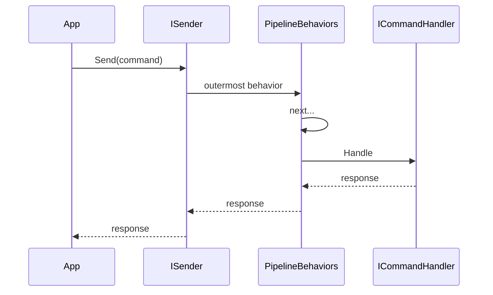

# BuildingBlocks.Mediator — design (SOLID / OOP)

**Package:** `BuildingBlocks.Mediator` 1.0.0  
**Related:** [mediator.md](mediator.md) (public interface freeze), [TEST_MATRIX.md](TEST_MATRIX.md)

## Architecture

| Concern | Type | Responsibility |
|---------|------|----------------|
| Contracts | `ISender`, `ICommand`, `IQuery`, handlers, `IPipelineBehavior` | ISP — narrow surfaces |
| Dispatch | `Mediator` + wrapper caches | SRP — resolve + invoke |
| DI | `AddMediator`, `HandlerAssemblyScanner` | DIP — compose via DI |
| Cross-cutting | Host behaviors + `UseTelemetry` | OCP — extend without changing core |
| Filters | `CommandPipelineBehavior` / `QueryPipelineBehavior` | OCP — specialize by message kind |

## SOLID mapping

- **S** — wrappers, scanner, telemetry, and validation are separate types.
- **O** — new behaviors via `AddOpenBehavior`; command/query filters via abstract bases.
- **L** — void `ICommand` is `ICommand<Unit>`; void path uses `ICommandHandler<T>` without breaking typed Send.
- **I** — prefer `ISender` over `IMediator` at call sites; no Publish on v1 surface.
- **D** — handlers and behaviors resolved from `IServiceProvider`; no static locator.

## Pipeline order

1. Sort registered behaviors by explicit `order` (ascending), then registration index.
2. `UseTelemetry` is optional Send enrichment (ActivitySource), not a pipeline behavior.
3. Runtime chain: first in DI enumerable = outermost (`Reverse` when composing).

## Non-goals (v1)

Publish, streams, exception handlers that replace results, Scrutor, FluentValidation-in-core.

Open-generic handlers **are** supported (scanner + on-demand closing). They always resolve as Transient via ActivatorUtilities regardless of `HandlerLifetime`.
