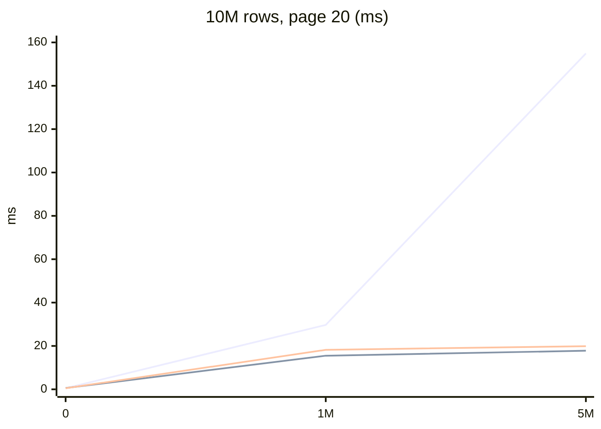
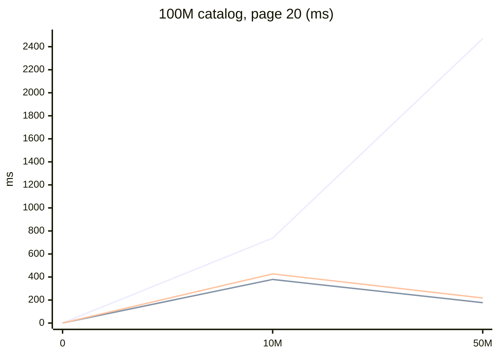

# BuildingBlocks.Pagination.EntityFrameworkCore

Typed **keyset (cursor)** pagination for EF Core: `SortKey`, opaque versioned cursors, and `IQueryable.ToCursorPageAsync`. One NuGet — the IR assembly is bundled; you do not install a second Pagination package.

[](https://www.nuget.org/packages/BuildingBlocks.Pagination.EntityFrameworkCore)
[](https://github.com/Maxofpower/FeatureFusion/releases?q=pagination-v)
[](https://dotnet.microsoft.com/)
[](https://opensource.org/licenses/MIT)

**When to use:** Stable “next page” over large tables without `OFFSET`. Map a host sort enum to a **prebuilt** `SortKey` — the library never turns `"Price"` into a property name.


Dapper is an **in-repo project** (not a NuGet package). A LinqToDB adapter is not shipped.

## What's new in 1.1.0

- **Npgsql row comparison** for uniform non-nullable multi-column keys of **any width** (`(a, b, …) >`). 2–8 slots use `ValueTuple.Create`; 9+ nest `TRest`. Mixed ASC/DESC and `string` slots stay on the expanded OR seek. Sqlite and SQL Server always use OR.
- **`ORDER BY NULLS FIRST/LAST`** on Npgsql/Sqlite when the host registers `AddBuildingBlocksPagination` + `UseBuildingBlocksPagination`. Stock LINQ cannot emit NULLS; a tagged command interceptor is the index-honest path (do not `CASE`/`IS NULL` in `OrderBy`). Dapper emits NULLS on those dialects without extra registration. SQL Server does not emit `NULLS`.
- **`HasKeysetIndex(sortKey, NullOrder)`** — optional Npgsql `HasNullSortOrder` on the composite index (soft API). The one-argument `HasKeysetIndex(sortKey)` does not write null-sort metadata. Npgsql omits `NULLS` from `CREATE INDEX` when it matches the column's ASC/DESC default.

## What you get

- **Keyset (cursor) pagination** — seek SQL instead of `OFFSET` / `SKIP`
- **Forward and backward** — `HasNext` / `HasPrevious`; empty cursor + `PageDirection.Backward` is the last page
- **Typed composite `SortKey`** — expressions ending in a unique column; enum registry, no `"Price"` reflection
- **EF Core** in this nupkg (`ToCursorPageAsync`); **Dapper** in-repo only (`QueryCursorPageAsync`, not packed)
- **`NullOrder` for strings** — seek + `ORDER BY … NULLS FIRST/LAST` on Npgsql/Sqlite when the host registers `AddBuildingBlocksPagination` + `UseBuildingBlocksPagination`. Does not emit NULLS on SQL Server. Nullable value types (`int?`, `DateTime?`, …) are rejected
- **Npgsql row comparison** — uniform non-null keys of any width use `(a,b,…) > …` when Npgsql is loaded; otherwise OR-chain
- **Optional total count** — `IncludeTotalCount` runs COUNT with the page (same QueryHint scope on SQL Server)
- **Cancellation** — `CancellationToken` on EF and Dapper page APIs
- **`QueryHint`** — allowlist `{ None, ReadUncommitted }`. `ReadUncommitted` is SQL Server session isolation only (not `WITH (NOLOCK)`); PG/Sqlite no-op
- **Large-table probe** — indexed SQLite `--probe` (Stopwatch, 10M / 100M) with live OFFSET ID checks; reports ms and mean managed KB per page; not a claim about SQL Server or PostgreSQL speed

## Install

```bash
dotnet add package BuildingBlocks.Pagination.EntityFrameworkCore
```

Requires **.NET 8**, **.NET 9**, or **.NET 10**. The nupkg depends on `Microsoft.EntityFrameworkCore` **aligned to the TFM** (8.x / 9.x / 10.x).

## Quick start

```csharp
var key = SortKey.For<Product>()
    .By(p => p.Price)
    .ThenByUnique(p => p.Id);

var page = await db.Products
    .AsNoTracking()
    .TagWith("products.list")
    .Where(p => !p.Deleted)
    .ToCursorPageAsync(new CursorRequest(cursor, 20), key);
```

Map `CursorPage<T>` to your HTTP DTO (`HasNext` → `HasMore`, `Next` → `NextCursor`). Prefer `ToCursorPageAsync(..., selector)` so the projection runs in SQL; `ToCursorPageMappedAsync` materializes entities first.

```csharp
builder.HasKeysetIndex(priceKey).HasDatabaseName("IX_products_price_id");
builder.HasKeysetIndex(priceDescKey).HasDatabaseName("IX_products_price_id_desc");
// Optional: match ORDER BY NULLS FIRST on an ASC string key (non-default for ASC).
builder.HasKeysetIndex(nameKey, NullOrder.First);
```

`(Price DESC, Id ASC)` is not a reverse scan of `(Price ASC, Id ASC)` — add both when you expose both directions. Nested paths (`Vendor.Name`) are not mapped; index those columns yourself.

**Npgsql multi-column seek:** when every sort slot is a non-nullable value type and directions are uniform, EF emits a Postgres row comparison `(a, b, …) > (@0, @1, …)` for **n columns** (same idea as the in-repo Dapper adapter). Mixed ASC/DESC, `string` keys, Sqlite, and SQL Server use the expanded OR form.

**NULLS FIRST/LAST:** call `services.AddBuildingBlocksPagination()` and `options.UseBuildingBlocksPagination()` so EF appends `NULLS FIRST/LAST` on Npgsql/Sqlite at **execute** time (a `DbCommandInterceptor` on queries tagged `BuildingBlocks.Pagination:First|Last`). LINQ has no NULLS API; wrapping `OrderBy` in `CASE` would typically prevent a matching btree from being used. `ToQueryString()` does not run interceptors — assert executed SQL. Without registration, `NullOrder` is seek-predicate only for EF. Dapper always emits NULLS on PG/Sqlite from `PaginationOptions.Nulls`. SQL Server does not emit `NULLS`.

Empty cursor + `PageDirection.Backward` is the last page.


There is **no** `IEnumerable` / in-memory adapter. Relational providers execute seek SQL. EF Core InMemory is the same API in-process (tests only).

## Caveats

- **HMAC on public HTTP.** Unsigned cursors are forgeable (`Walk` and key values). Set `PaginationOptions.SigningKey` for untrusted clients. Omit the key only for trusted internal callers.
- **Host `OrderBy` is replaced**, not merged. Put filters/`AsNoTracking`/`TagWith` on the query; the sort comes from `SortKey`.
- **Nullable value types are unsupported.** `int?` / `DateTime?` / `bool?` / nullable enums throw `NullableSortUnsupported` at `SortKey` construction. Coalesce in the model. On PostgreSQL and Sqlite, `NullOrder` drives seek **and** `ORDER BY … NULLS FIRST/LAST` when the host registers `AddBuildingBlocksPagination` + `UseBuildingBlocksPagination` (Dapper emits NULLS without that). SQL Server does not emit `NULLS`. `string` remains allowed.
- **Guid vs SQL Server.** CLR `Guid` ordinal comparison matches SQLite/PostgreSQL. SQL Server `uniqueidentifier` order is different for some sets — do not assume CLR `>` equals SQL Server order.
- **`QueryHint.ReadUncommitted`:** SQL Server **session isolation** (`READ UNCOMMITTED`), not table-hint `WITH (NOLOCK)`. EF begins one transaction around COUNT (if requested) and PAGE when there is no ambient transaction, then restores `READ COMMITTED` on the still-open connection. An ambient transaction is **ignored** (no nest). Dapper prefixes `SET TRANSACTION ISOLATION LEVEL READ UNCOMMITTED;` on both COUNT and page SQL, then restores `READ COMMITTED` on the open connection. PostgreSQL and Sqlite no-op. Host `WITH (NOLOCK)` in Dapper SQL is still allowed when `Hint` is `None`.
- **Updates to a sort column** can make a row reappear or vanish (inherent keyset). Inserts after the cursor show up on later pages; that is expected.

## QueryHint

Allowlist is `{ None, ReadUncommitted }` (no `NOLOCK` / `UPDLOCK` / raw hint strings).

| Provider | `Hint = None` | `Hint = ReadUncommitted` |
|----------|---------------|--------------------------|
| SQL Server EF | Provider default; no extra SQL | One `ReadUncommitted` transaction around COUNT (if requested) **and** PAGE; then `READ COMMITTED` on the still-open connection |
| SQL Server Dapper | Host SQL unchanged | Prefix `SET TRANSACTION ISOLATION LEVEL READ UNCOMMITTED;` on COUNT and page; then restore `READ COMMITTED` |
| PostgreSQL / Sqlite | No-op | No-op |
| Ambient EF transaction | Unchanged | **Ignored** (no nested transaction) |

This is session isolation, not table-hint `WITH (NOLOCK)`. Host `WITH (NOLOCK)` in Dapper SQL remains valid when `Hint` is `None`.

## Quick start — all options

```csharp
var options = new PaginationOptions
{
    MaxLimit = 100,
    IncludeTotalCount = string.IsNullOrEmpty(cursor),
    SigningKey = hmacKey, // set on public APIs
    Nulls = NullOrder.Last,
    Hint = QueryHint.None
};

CursorCodec.TryValidateFormat(cursor, options);
CursorCodec.Validate(cursor, sortKey, options);

var dtos = await db.Products.ToCursorPageAsync(
    request, key, p => new ProductDto(p.Id, p.Name, p.Price));

var mapped = await db.Products.ToCursorPageMappedAsync(
    request, key, p => p.ToDto());

var shadow = SortKey.For<Order>()
    .ByShadow<DateTime>("CreatedAtUtc")
    .ThenByUnique(o => o.Id);
```

Enum → key (not `"Price"` → `GetProperty`):

```csharp
var registry = new SortKeyRegistry<ProductSortField, Product>()
    .Add(ProductSortField.Price, key);
registry.EnsureComplete();
```

Sort a mapped scalar (enum, bool, `DateOnly`, `p => p.Money.Amount`). Do not `By` a value object, `byte[]`, navigation, or `T?`.

`AsNoTracking` / `TagWith` belong on the host `IQueryable` **before** paging. Optional `PaginationOptions.Hint` defaults to `None` (no extra SQL). `ReadUncommitted` is SQL Server session isolation, not `WITH (NOLOCK)`.

## Performance

Indexed keyset grows more slowly than `OFFSET` as skip increases. The tables below are a **file SQLite SQL** `--probe` (Stopwatch: 1 warmup + 5 repeats). They are **not** BenchmarkDotNet, not EF InMemory, not `--job Dry`, and not a 5k-row micro-benchmark. OFFSET ID equality is checked **once, untimed**, before `TimeAndAlloc()`. Query timing is after load (`synchronous=OFF` is insert-only). Index `(Price, Id)`, page size 20, .NET 10. **KB** is mean managed allocations per page (`GC.GetAllocatedBytesForCurrentThread`), not working set or SQLite cache.

Default BenchmarkDotNet (`--filter *Keyset*`) is a separate 1M-row job with `MemoryDiagnoser`; do not mix those milliseconds with `--probe`.

**Hardware (this machine):** 11th Gen Intel Core i9-11900K @ 3.50 GHz (8 cores / 16 logical), 63.8 GB RAM, Windows 10.0.26200, .NET SDK 10.0.301 / runtime 10.0.9, EF Core 10.0.0, BenchmarkDotNet 0.15.4, SQLitePCLRaw 3.0.3.

**10 million rows** (`--probe 10000000`):

| Skip | OFFSET | FeatureFusion | MR.EntityFrameworkCore.KeysetPagination 1.5.0 |
|------|--------|---------------|-----------------------------------------------|
| 0 | 0.5 ms / 77 KB | 0.6 ms / 79 KB | 0.5 ms / 75 KB |
| 1,000,000 | 29.7 ms / 77 KB | 15.5 ms / 85 KB | 18.2 ms / 86 KB |
| 5,000,000 | 154.9 ms / 77 KB | 17.8 ms / 85 KB | 19.9 ms / 86 KB |



**100 million rows** (`--probe 100000000`, `PAGINATION_PROBE_DB` on a volume with ~20+ GB free):

| Skip | OFFSET | FeatureFusion | MR.EntityFrameworkCore.KeysetPagination 1.5.0 |
|------|--------|---------------|-----------------------------------------------|
| 0 | 0.6 ms / 77 KB | 0.7 ms / 79 KB | 0.6 ms / 75 KB |
| 10,000,000 | 737.9 ms / 75 KB | 379.0 ms / 84 KB | 427.0 ms / 84 KB |
| 50,000,000 | 2470.4 ms / 75 KB | 177.2 ms / 83 KB | 218.0 ms / 85 KB |



First page is cheap either way. At skip 50M on this catalog, FeatureFusion is about **14×** `OFFSET` (177 ms vs 2470 ms). SQLite plans are not SQL Server or PostgreSQL plans. Reproduce (**never** quote Dry/cold-start):

```bash
dotnet run -c Release --project benchmarks/BuildingBlocks/Pagination.EntityFrameworkCore.Benchmarks -- --filter *CursorCodec*
dotnet run -c Release --project benchmarks/BuildingBlocks/Pagination.EntityFrameworkCore.Benchmarks -- --filter *Keyset*
dotnet run -c Release --project benchmarks/BuildingBlocks/Pagination.EntityFrameworkCore.Benchmarks -- --probe 10000000
dotnet run -c Release --project benchmarks/BuildingBlocks/Pagination.EntityFrameworkCore.Benchmarks -- --probe 100000000
```

Methodology, competitor notes, and limitations: [benchmarks README](https://github.com/Maxofpower/FeatureFusion/blob/main/benchmarks/BuildingBlocks/Pagination.EntityFrameworkCore.Benchmarks/README.md). FeatureFusion vs MR is query-shape, not cursor API.

## Layout (EF Core style)

```text
Extensions/           public ToCursorPageAsync / HasKeysetIndex (like EntityFrameworkQueryableExtensions)
Query/Internal/       OrderBy / seek expression trees
Infrastructure/Internal/  DbContext, QueryHint, NULLS interceptor, soft Npgsql HasNullSortOrder
```

The IR (`SortKey`, `CursorCodec`, `CursorPage`) is a non-packable sibling project, bundled into this nupkg as `BuildingBlocks.Pagination.dll`.

## Lab (FeatureFusion)

Same `GetProductsQuery` on the FeatureFusion PostgreSQL catalog (do not set `QueryHint.ReadUncommitted`):

- `GET /api/v2/products-page` — Minimal API (EF; POST kept)
- `POST /api/v2/Product/products` — MVC controller (EF)
- `POST /api/v2/Product/products-dapper` — MVC Dapper showcase (not packed)
- MCP `products.list`

First page → `NextCursor` → `PreviousCursor`: see the [pagination docs](https://github.com/Maxofpower/FeatureFusion/blob/main/docs/building-blocks/pagination.md#runnable-showcase-featurefusion).

## Docs

- [pagination.md](https://github.com/Maxofpower/FeatureFusion/blob/main/docs/building-blocks/pagination.md)
- [PAGINATION_TEST_MATRIX.md](https://github.com/Maxofpower/FeatureFusion/blob/main/docs/building-blocks/PAGINATION_TEST_MATRIX.md)
- ADR [0003](https://github.com/Maxofpower/FeatureFusion/blob/main/docs/adr/0003-pagination-keyset.md)
